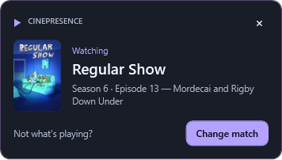
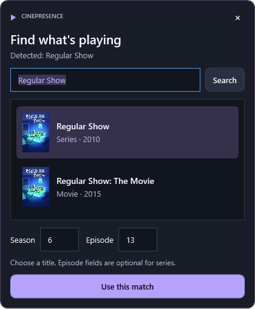

  

<h1 align="center">CinePresence</h1>

<strong>Your movie night, on Discord.</strong> 
A Windows tray app that shares what you're watching—with artwork, episode details, and live playback progress.

  
  
  

  <a href="https://github.com/karaagexc/CinePresence/releases/latest"><strong>Download for Windows</strong></a> ·
  <a href="docs/BROWSER-COMPANION.md">Connect your browser</a> ·
  <a href="https://github.com/karaagexc/CinePresence/issues">Report an issue</a>

---

## Let your presence follow the show

- **Recognize movies and series.** TMDB supplies the title, poster, release year, and episode name when the player provides enough detail.
- **Keep progress in sync.** Position, duration, seeks, and playback speed come from your player. Pausing clears your Discord activity.
- **Stay with the first playing source.** Another player takes over when it pauses or stops. You can also pin or exclude a source.
- **Correct a match in a few clicks.** The watching popup fades into a searchable poster picker with season and episode fields. Corrections are remembered.

<table>
  <tr>
    <td width="47%" valign="top"><strong>A small heads-up</strong>   Appears on the right, then dismisses after seven seconds. Hover to keep it open.</td>
    <td width="53%" valign="top"><strong>An easy correction</strong>   Change match stays inside the popup. Search, choose, and continue watching.</td>
  </tr>
</table>

## Get started

1. **Install CinePresence.** Download the installer from [Releases](https://github.com/karaagexc/CinePresence/releases/latest). Prefer portable apps? Extract the entire ZIP and run `CinePresence.exe`. Both include .NET.
2. **Connect your accounts.** Keep Discord desktop open with activity sharing enabled. Add your own **TMDB API Read Access Token** in CinePresence → Settings; get one from [TMDB](https://www.themoviedb.org/settings/api). No Discord user token is needed.
3. **Set up your player.** Windows media sessions work automatically where supported. For browser pages with limited metadata, follow the optional [Chrome/Edge companion guide](docs/BROWSER-COMPANION.md). VLC also has an optional [local HTTP adapter](docs/VLC-SETUP.md).
4. **Press play.** Check Now Playing or Sources. Use **Change match** in the popup—or **Correct match** in the app—if the result needs adjusting.

> **Companion setup:** the installer prepares the local connection. This preview extension still requires **Developer mode → Load unpacked** in your browser. After an update, reload the extension and refresh your playback tabs.

## What works?

| Source | Detection | What to expect |
| --- | --- | --- |
| Chrome / Edge | Optional browser companion or Windows media sessions | Reads available page metadata and HTML video timing, including embedded players. No streaming-site whitelist. |
| VLC | Windows media sessions or authenticated localhost HTTP | Uses the media title or filename and the player's actual timeline. |
| Windows media players | Windows media sessions | Support depends on the installed player and the fields it exposes. |
| Live shows | Recognizable TMDB series metadata | Shares the show without inventing an episode or countdown. |

**Movies and series only.** Spotify, social feeds, and general video platforms such as YouTube, Facebook, Twitter/X, Instagram, VK, Vimeo, and Dailymotion are excluded. [See the full restrictions](docs/BROWSER-COMPANION.md#restrictions-and-privacy).

Some players expose too little information to identify a title automatically. Ambiguous matches stay unshared until corrected. Discord controls the final activity layout; a Spotify-identical progress display is not guaranteed.

## Quiet by design

Close the window to keep CinePresence in the tray. Sharing can be switched off immediately; startup at login is optional. Credentials are protected with Windows DPAPI, and settings stay on your computer. There is no hosted CinePresence backend or telemetry.

[Playback & privacy](docs/BEHAVIOR.md) · [Build from source](docs/DEVELOPMENT.md) · [Compatibility & validation](docs/VALIDATION.md)

---

This product uses the TMDB API but is not endorsed or certified by TMDB. CinePresence is not affiliated with Discord or VideoLAN. See [third-party notices](THIRD-PARTY-NOTICES.md). Windows 11 x64; current installers are unsigned.
